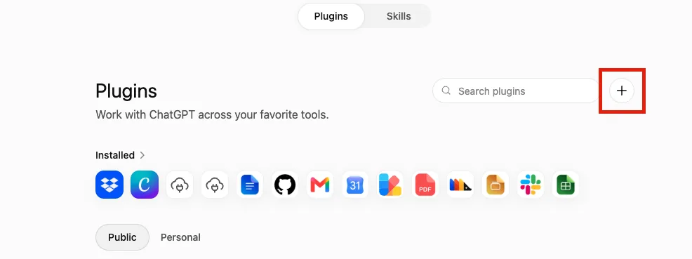
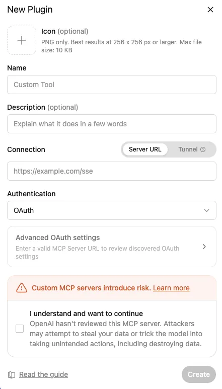

# Install and use Gate with ChatGPT

## One-line installation

Supported in the first scope: macOS, Linux and WSL.

```bash
curl -fsSL https://raw.githubusercontent.com/spelcc/gate/main/install.sh | bash
```

The installer uses `~/.gate` for releases and persistent data, creates `~/.local/bin/gate`, installs uv with Python 3.12, nvm with Node 22, and ngrok when missing. Interactive input is read from `/dev/tty`, so the command works through a shell pipe.

Useful commands:

```bash
gate
gate start
gate stop
gate restart
gate status
gate doctor
gate log
gate logs --follow
gate secret
gate update
gate update --edge
gate update --stable
gate update --version 0.1.14-beta.1
gate rollback
gate uninstall
gate uninstall --purge
gate connect cf
gate connect ts
```

`gate log` attaches to the redacted realtime activity snapshot of a running daemon. It includes Gate tool calls, discovered/downstream MCP calls, resource reads, prompt renders, and semantic OAuth/public-file HTTP activity. `run_command` keeps its richer terminal command/log fields. In a terminal it refreshes continuously until `Ctrl+C`; when piped, it prints one snapshot. It does not restart Gate or require the legacy `--realtime` startup flag.

`gate uninstall` preserves config, data, logs and skills. `gate uninstall --purge` requires typing `DELETE` and removes all Gate data.

## Manual and advanced installation


Cross-platform guide for macOS, Linux, and Windows. The local gateway listens on port `8761`. ngrok exposes this port over HTTPS. ChatGPT connects to `/mcp` and handles the OAuth flow automatically.

On macOS, Gate targets ngrok at the active LAN address instead of `localhost`. This prevents another loopback-only process on port `8761` from shadowing Gate. Set `GATE_NGROK_TARGET` to override the detected upstream.

### Changing the gateway port

The default port is `8761`. If an unrelated app occupies it, set a different port once in `config/.env` and every component (gateway, launcher, tunnel) follows:

```text
GATEWAY_PORT=8762
```

Optionally set `GATEWAY_AUTO_PORT=true` so the interactive launcher picks the next free port automatically. Gate still refuses to start when the port is held by *another copy of Gate*, because two gateways sharing one data directory would corrupt state — stop the other copy instead.

## 1. Requirements

- GitHub account with repository access.
- Python 3.10 or newer.
- Node.js 18 or newer.
- [ngrok](https://dashboard.ngrok.com/signup) account.
- ChatGPT web. Full MCP support depends on your plan and workspace permissions.
- A logged-in graphical desktop session for screenshot, keyboard, and mouse tools.

Check installed versions:

```text
git --version
python --version
node --version
```

## 2. Clone the repository

HTTPS:

```bash
git clone https://github.com/spelcc/gate.git myMCP
cd myMCP
```

## 3. Install Python dependencies

### macOS and Linux

```bash
python3 -m venv .venv
source .venv/bin/activate
python -m pip install --upgrade pip
python -m pip install -r requirements.txt
```

### Windows PowerShell

```powershell
py -3 -m venv .venv
Set-ExecutionPolicy -Scope Process Bypass
.\.venv\Scripts\Activate.ps1
python -m pip install --upgrade pip
python -m pip install -r requirements.txt
```

`requirements.txt` is the single source of truth for Python dependencies. `start_services.py` installs from this file at startup, so package names and versions are not duplicated.


## Tunnel providers

Gate supports four tunnel modes through `TUNNEL_PROVIDER`:

```env
TUNNEL_PROVIDER=ngrok
```

- `ngrok`: default. Gate starts ngrok and detects its public HTTPS URL. Existing installations keep this behavior.
- `tailscale`: Gate validates the Tailscale CLI and login, starts `tailscale funnel --bg=false 8761`, and stores the Funnel HTTPS URL as `MCP_BASE_URL`. Tailscale Serve without Funnel is tailnet-only and cannot be reached directly by ChatGPT.
- `cloudflare`: Gate starts a free, account-less Cloudflare quick tunnel through `cloudflared` and stores its `trycloudflare.com` HTTPS URL as `MCP_BASE_URL`.
- `external`: Gate does not start a tunnel. Set `MCP_BASE_URL` to a public HTTPS endpoint that forwards to local port `8761`.

### Tailscale Funnel

The quickest way to get Tailscale ready for Gate is:

```bash
gate connect ts
# or, from a checkout:
./run.sh connect ts
# Windows:
.\run.ps1 -ConnectTs
```

It installs the Tailscale CLI when missing (Homebrew on macOS, winget on Windows, the official installer elsewhere), starts the local Tailscale daemon when its API socket is unavailable, walks you through `tailscale up` when you are not logged in, and grants the non-root serve permission Gate needs (`sudo tailscale set --operator=$USER`). A status timeout is reported without launching or restarting a daemon because it may already be running but temporarily unresponsive. On macOS it tries the Homebrew service and then the Tailscale app; the Homebrew command registers a persistent root launchd service that starts at boot. On Linux it starts `tailscaled` through systemd (or the service manager), and on Windows it starts the Tailscale service. When everything is ready it prints the launch command.

Alternatively, set everything up by hand:

```bash
tailscale up
tailscale status
```

Then set:

```env
TUNNEL_PROVIDER=tailscale
```

Run `./run.sh setup` on macOS, Linux, or WSL. On Windows, set the same value in `config/.env` before launching `run.ps1`. Funnel availability depends on the tailnet policy and Tailscale account configuration. Gate reports an actionable error when the CLI, login, or public Funnel URL is unavailable.

### Cloudflare Tunnel (quick tunnel)

Install `cloudflared`:

```bash
# macOS
brew install cloudflared

# Debian/Ubuntu (x86_64; use cloudflared-linux-arm64 on ARM64)
curl -L https://github.com/cloudflare/cloudflared/releases/latest/download/cloudflared-linux-amd64 \
  -o ~/.local/bin/cloudflared
chmod +x ~/.local/bin/cloudflared

# Windows
winget install --id Cloudflare.cloudflared
```

Then set:

```env
TUNNEL_PROVIDER=cloudflare
```

Run `./run.sh setup` on macOS, Linux, or WSL. Gate launches `cloudflared tunnel --url http://127.0.0.1:8761`, waits for the `trycloudflare.com` URL, and saves it as `MCP_BASE_URL`. No Cloudflare account or token is required.

Quick tunnels are transient: the random `trycloudflare.com` subdomain changes whenever the tunnel restarts. After a restart, re-run `./run.sh setup` so Gate stores the new URL. Also note that Cloudflare refuses quick tunnels when a `config.yaml` or `config.yml` file exists in `~/.cloudflared/`; rename that file if you have one.

#### Cloudflare connect (named tunnel)

When `./run.sh setup` runs interactively, choosing **2. Cloudflare connect** keeps the same hostname across restarts by creating a named tunnel on your Cloudflare account and routing a hostname on one of your domains to it. This is the stable option if you want a persistent `MCP_BASE_URL` and a custom domain.

The setup flow:

1. Logs in: `cloudflared tunnel login` opens a browser so you can authorize your Cloudflare account (writes `~/.cloudflared/cert.pem`). It is skipped when you are already logged in.
2. Creates the tunnel if needed: `cloudflared tunnel create gate` (default name `gate`).
3. Asks for a public hostname (for example `mcp.example.com`) and routes it: `cloudflared tunnel route dns gate mcp.example.com`. The domain must be on the same Cloudflare account.
4. Stores `CLOUDFLARED_TUNNEL_NAME=gate` and `MCP_BASE_URL=https://mcp.example.com` in `config/.env`.

Gate then launches `cloudflared tunnel run --url http://127.0.0.1:8761 gate` on every start, reusing the same hostname. The `--url` flag provides the single-origin ingress rule for a CLI-created tunnel (without any ingress, cloudflared answers 503). If you keep a `~/.cloudflared/config.yml` with **multiple** ingress rules, `cloudflared` rejects the `--url` flag with "You can't set the --url flag … when using multiple-origin ingress rules"; remove or simplify that file, or run the tunnel with its own ingress configuration. To choose the mode again, set `CLOUDFLARED_TUNNEL_NAME` (or remove it) in `config/.env` before re-running setup.

The same flow is available as a one-shot CLI command, without running the interactive `./run.sh setup`:

```bash
gate connect cf
# Or with explicit values (skips prompts):
gate connect cf --name gate --hostname mcp.example.com
```

`gate connect cf` installs `cloudflared` when missing (after a prompt unless `--yes`; macOS uses Homebrew, Windows uses winget, and Linux downloads the correct `cloudflared-linux-<arch>` binary for your machine into `~/.gate/runtime/bin` — no `sudo` needed), logs in only when not already logged in, creates the tunnel if it does not exist, routes DNS, and writes `TUNNEL_PROVIDER=cloudflare`, `CLOUDFLARED_TUNNEL_NAME`, `MCP_BASE_URL`, and the OAuth issuer values to `config/.env`. It does not complete OAuth; when the required secrets are still missing it tells you to run `gate setup`. `gate setup` then reuses the hostname you configured and does not re-run DNS provisioning. `gate connect cloudflare` is accepted as an alias.

The hostname you type is the full public subdomain on your Cloudflare domain. For example, with `mcp.example.com`, `cloudflared tunnel route dns gate mcp.example.com` creates a CNAME on your zone (`example.com`) pointing the `mcp` subdomain at the tunnel, and Gate stores `MCP_BASE_URL=https://mcp.example.com`. When no hostname is given, `gate connect cf` prompts for one with the default `mcp.<zone>` (the zone is read from `~/.cloudflared/cert.pem`); press Enter to accept it or type another subdomain — a single label like `mcp` is completed to `mcp.<zone>`. If an existing `MCP_BASE_URL` from another provider (ngrok, Tailscale, quick tunnel) is present, `gate connect cf` refuses to reuse it and prompts for a fresh hostname instead — it never mixes a foreign URL into your Cloudflare domain.

The tunnel name can also be set ahead of time so setup skips the interactive choice:

```env
TUNNEL_PROVIDER=cloudflare
CLOUDFLARED_TUNNEL_NAME=gate
```

On Windows, the named-tunnel mode is configured the same way in `config/.env`, but `MCP_BASE_URL` must already be set to your `https://<hostname>` because `run.ps1` performs no browser-based onboarding.

### Externally managed tunnel

```env
TUNNEL_PROVIDER=external
MCP_BASE_URL=https://mcp.example.com
```

The external endpoint must use HTTPS and forward to `http://127.0.0.1:8761`. Do not append `/mcp` to `MCP_BASE_URL`. Gate still derives OAuth issuer and connector URLs from this canonical base URL.

## 4. Install and connect ngrok

### macOS

```bash
brew install ngrok
```

### Debian or Ubuntu Linux

```bash
curl -sSL https://ngrok-agent.s3.amazonaws.com/ngrok.asc \
  | sudo tee /etc/apt/trusted.gpg.d/ngrok.asc >/dev/null
echo "deb https://ngrok-agent.s3.amazonaws.com bookworm main" \
  | sudo tee /etc/apt/sources.list.d/ngrok.list
sudo apt update
sudo apt install ngrok
```

For other Linux distributions and CPU architectures, use the [official Linux download page](https://ngrok.com/download/linux).

### Windows PowerShell

```powershell
winget install ngrok -s msstore
```

Alternative: use the [official Windows installer or standalone executable](https://ngrok.com/download/windows).

### Connect the ngrok account

Create an ngrok account. Open [Your Authtoken](https://dashboard.ngrok.com/get-started/your-authtoken). Copy the displayed token. Then run:

```bash
ngrok config add-authtoken YOUR_NGROK_AUTHTOKEN
ngrok config check
ngrok version
```

`NGROK_AUTHTOKEN` is an ngrok secret. It stays in your local ngrok configuration. Never put it in `.env`, GitHub, or ChatGPT.

Official documentation: [ngrok installation](https://ngrok.com/docs/getting-started/) and [`add-authtoken` command](https://ngrok.com/docs/agent/cli/#ngrok-config-add-authtoken). The ngrok agent supports macOS, Linux, and Windows.

## 5. Open the tunnel once

Terminal 1:

```bash
ngrok http 8761
```

Copy the HTTPS URL shown after `Forwarding`. Example:

```text
https://example.ngrok-free.dev
```

On the free plan, this URL may change after a restart. When it changes, update `config/.env` and the ChatGPT MCP plugin.

## 6. Configure the gateway

macOS or Linux:

```bash
mkdir -p config
cp config/.env.example config/.env
```

Windows PowerShell:

```powershell
New-Item -ItemType Directory -Force config | Out-Null
Copy-Item config/.env.example config/.env
```

Edit `config/.env`:

```dotenv
MCP_BASE_URL=https://example.ngrok-free.dev
MCP_SERVERS_CONFIG=config/mcp.json
MCP_TOOL_EXPOSURE_MODE=discover
OAUTH_ISSUER=https://example.ngrok-free.dev/oauth
LOCAL_OAUTH_ISSUER=https://example.ngrok-free.dev/oauth
OAUTH_AUDIENCE=https://mcp.local
MCP_AUDIENCE=https://mcp.local
OAUTH_ACCESS_SECRET=YOUR_READABLE_SECRET
OAUTH_ACCESS_SECRET_HASH=$argon2id$YOUR_HASH
OAUTH_TOKEN_TTL_SECONDS=2592000
OAUTH_LOGIN_MAX_ATTEMPTS=5
OAUTH_TRUSTED_PROXY_NETWORKS=127.0.0.0/8,::1/128
OAUTH_AUTO_REGISTER_AUTH_CLIENTS=true
ENABLE_OAUTH=true
```

All three public URL values must use the exact same ngrok domain. Do not append `/mcp` to `MCP_BASE_URL`.

`MCP_TOOL_EXPOSURE_MODE=discover` is the default. Gate keeps downstream MCP servers connected but exposes only a small core tool surface to ChatGPT:

```text
run_command
skills_search
skills_read
mcp_servers_list
mcp_tools_search
mcp_tool_read
mcp_tool_call
skills_create
```

The normal discovery flow is `mcp_tools_search` → `mcp_tool_read` → `mcp_tool_call`. This avoids putting every JSON schema into the initial model context. The search covers both first-party Gate tools and downstream MCP tools. First-party results use `server_name="gate"`; downstream results keep their configured server name. `mcp_tools_search` searches tool names, titles, descriptions, and downstream server/prefix names. When the optional command queue is enabled, Gate also exposes the queue polling/control helpers required by `run_command`.

Discover mode exposes `skills_create` directly alongside the search/read tools. Other first-party Gate tools, including `conversation_start`, `conversation_note`, `auth_status`, `public_file_share`, `public_file_list`, `public_file_revoke`, `mcp_server_status`, `mcp_server_reload`, and `mcp_registry_refresh`, stay out of the initial tool list but remain searchable, readable, and callable through the discovery flow with `server_name="gate"`. Use `full` mode when those direct tools are preferred. Normal command calls can still create their conversation log automatically when a `conversation_id` is supplied. To reconcile edits to `config/mcp.json` without switching to full mode or restarting Gate, call `mcp_servers_list` with `refresh=true`. Gate schedules one registry refresh and returns the current server state immediately; repeated refresh requests are coalesced while that refresh is running. The response always includes a `refresh` state (`idle`, `scheduled`, `running`, `completed`, `failed`, or `cancelled`); failed manual refreshes include the configuration error. Call `mcp_servers_list` again to inspect the updated state and refresh result.

For one launch with the historical eager behavior:

```bash
gate --tools full
# or daemon mode
gate --tools full start
```

For a persistent override, set `MCP_TOOL_EXPOSURE_MODE=full` in `config/.env`. Use `discover` to return to the default.

Generate the access-secret hash without placing the secret in shell history:

```bash
.venv/bin/python -c "from getpass import getpass; from argon2 import PasswordHasher; print(PasswordHasher().hash(getpass('OAuth access secret: ')))"
```

On Windows, run the same command as `.venv\\Scripts\\python.exe -c "..."`. Copy only the resulting `$argon2id$...` value to `OAUTH_ACCESS_SECRET_HASH`. Save the original secret in a password manager; the hash cannot recover it.

`OAUTH_TRUSTED_PROXY_NETWORKS` lets the local ngrok proxy provide the real client IP for login limiting. Keep it restricted to loopback for the documented setup. Leave it empty if no trusted local reverse proxy is used.

Git ignores `config/.env`. Never add the ngrok token to it.

The OAuth-protected `/rt` interface captures redacted tool payloads, results,
and common fields for on-demand inspection. Automatic redaction only covers
secrets Gate knows about. If calls can contain unknown credentials or private
content, use metadata-only monitoring:

```dotenv
GATE_REALTIME_CAPTURE_RAW_DATA=false
```

This removes payloads, results, and common fields from the realtime store. It
does not disable command logs; protect the `logs/` directory separately.

### Configure MCP subservers

Install the pinned Open Computer Use MCP server:

```bash
npm install --global open-computer-use@0.2.0
open-computer-use doctor
open-computer-use call list_apps
```

On macOS, grant Accessibility and Screen Recording permissions when requested.

Then copy the Computer Use example:

```bash
cp config/mcp.json.example config/mcp.json
```

Windows PowerShell:

```powershell
Copy-Item config/mcp.json.example config/mcp.json
```

Gate reads the classic `mcpServers` JSON format. It supports stdio entries with `command`, `args`, `env`, and `cwd`, plus HTTP/SSE entries with `url`, `transport`, `headers`, and `auth`.

`toolPrefix` controls the public namespace. Without it, the server name is converted to snake_case. For example, `computer-use` exposes tools as `computer_use_*`.

Gate-specific options:

```json
{
  "mcpServers": {
    "example": {
      "command": "${EXAMPLE_MCP_BIN}",
      "args": ["serve"],
      "cwd": "workspace",
      "toolPrefix": "example",
      "enabled": true,
      "initTimeoutMs": 10000,
      "timeout": 30000,
      "tools": {
        "dangerous_tool": {"enabled": false}
      }
    }
  }
}
```

`${VAR}` placeholders are resolved from `config/.env` and the process environment. Relative `cwd` values resolve from the Gate project root. Gate watches this file and reconciles valid changes automatically. Invalid or partial writes keep the last healthy catalog until the next successful refresh.

The local `config/mcp.json` file is ignored by Git because it may contain secrets. Prefer `${VAR}` placeholders. Missing variables, unavailable binaries, and unreachable servers disable only the affected server.

## 7. Start the server

### macOS

```bash
./run.sh
```

This starts the gateway and ngrok. On first launch, `run.sh` repairs missing OAuth setup, then prints the connector URL and newly generated access secret. Save that secret. Later launches reuse it without printing it again.

Gateway and ngrok output stay in log files. The terminal shows only their status, so setup values remain easy to copy. When available, `run.sh` automatically uses macOS `caffeinate` to prevent sleep. `Ctrl+C` stops both.

While interactive mode is running, press `m` without Enter to show all local and public URLs, the ChatGPT setup page, and the OAuth access secret.

On macOS, Linux, and WSL, `run.sh` delegates interactive keys and process shutdown to a small Python supervisor. `Ctrl+C` terminates ngrok, the gateway supervisor, MCP, and OAuth together.

Inspect requests, headers, and responses in the local ngrok interface: [http://127.0.0.1:4040](http://127.0.0.1:4040). `run.sh`, `run.sh start`, and `run.sh status` print this URL while ngrok is running.

### Linux

```bash
./run.sh
```

`run.sh` works without `caffeinate` on Linux. Sleep prevention is optional; see the next section.

### Windows PowerShell

```powershell
.\run.ps1
```

This starts the gateway and ngrok. `Ctrl+C` stops the launcher and its process tree.

Keep this terminal open while using `mcp dl` in ChatGPT.

Background mode is available on macOS and Linux:

```bash
./run.sh start
./run.sh status
./run.sh stop
```

Repair incomplete setup or rotate the readable OAuth secret:

```bash
./run.sh setup
./run.sh renew-secret
```

`renew-secret` prints the new secret once. Restart running services afterward.
The generated `config/.env` also keeps `# Rotate OAuth access secret: ./run.sh renew-secret` as a local reminder.

Manual alternative on macOS and Linux:

```bash
source .venv/bin/activate
python3 start_services.py
```

Then, in a second terminal:

```bash
ngrok http 8761
```

Manual alternative on Windows, terminal 1:

```powershell
.\.venv\Scripts\Activate.ps1
python start_services.py
```

Windows terminal 2:

```powershell
ngrok http 8761
```

## 8. Prevent the computer from sleeping

Sleep prevention matters because sleep stops the gateway, ngrok tunnel, and GUI automation.

### macOS: `caffeinate`

`run.sh` detects and uses the built-in `caffeinate` command automatically. No extra installation is required.

### Linux: `systemd-inhibit`

On systemd-based distributions:

```bash
systemd-inhibit --what=sleep --why="Gate is running" ./run.sh
```

`systemd-inhibit` holds a sleep inhibitor only while `run.sh` is running. It is optional. Other init systems need their own equivalent.

### Windows: PowerToys Awake

Use [Microsoft PowerToys Awake](https://learn.microsoft.com/en-us/windows/powertoys/awake). Enable **Keep awake indefinitely** while Gate is running. Enable **Keep screen on** when testing vision or GUI automation.

PowerToys Awake works only while the user is signed in. GUI automation also requires an unlocked interactive desktop.

## 9. Check the endpoints

macOS or Linux:

```bash
curl -fsS http://localhost:8761/oauth/health
curl -fsS http://localhost:8761/oauth/.well-known/oauth-authorization-server
```

Public, using your domain:

```bash
export MCP_PUBLIC_URL=https://example.ngrok-free.dev
curl -fsS "$MCP_PUBLIC_URL/oauth/health"
curl -fsS "$MCP_PUBLIC_URL/oauth/.well-known/oauth-authorization-server"
```

Expected health-check response: JSON containing `"ok": true`.

Logs:

```bash
tail -f logs/services/gateway.log
```

Windows PowerShell:

```powershell
Invoke-RestMethod http://localhost:8761/oauth/health
Invoke-RestMethod http://localhost:8761/oauth/.well-known/oauth-authorization-server
Get-Content logs/services/gateway.log -Wait
```

## 10. Platform compatibility

| Capability | macOS | Linux | Windows |
|---|---:|---:|---:|
| Gateway, OAuth, ngrok | Yes | Yes | Yes |
| Shell and configurable MCP proxies | Yes | Yes | Yes |
| Computer Use example | Yes | No | No |
| One-command launcher | `run.sh` | `run.sh` | `run.ps1` |
| Automatic sleep prevention | `caffeinate` | Optional `systemd-inhibit` | Optional PowerToys Awake |

Platform notes:

- macOS: Computer Use manages its own Screen Recording and Accessibility permissions.
- Shell commands use the native operating-system shell. Commands written for Bash will not automatically work in Windows `cmd.exe`.

## 11. Enable ChatGPT developer mode

The interface changes over time. Use ChatGPT web.

Current user path:

1. Open [ChatGPT Settings](https://chatgpt.com/#settings/Personalization).
2. Go to **Apps** → **Advanced settings**.
3. Enable **Developer mode**.

Depending on your plan and role, an admin may need to allow this feature first:

- Business: admin/owner.
- Enterprise/Edu: **Workspace settings** → **Permissions & roles** → **Connected data**. The user then enables developer mode in their own settings.
- Pro: MCP may be limited to read/fetch actions, depending on OpenAI rollout.

Official reference: [Developer mode and MCP apps in ChatGPT](https://help.openai.com/en/articles/12584461-developer-mode-and-full-mcp-connectors-in-chatgpt-beta%29).

## 12. Add the `mcp dl` plugin

The interface may call it a **Plugin**, **App**, or **custom MCP app**.

1. Open ChatGPT in your browser.
2. Open **Plugins**.
3. Click the **+** button to the right of the search field.



4. Complete the **New Plugin** form:

   - **Name**: `mcp dl`
   - **Description**: `Local computer tools through Gate` (optional)
   - **Connection**: `Server URL`
   - **Server URL**: your ngrok URL followed by `/mcp`
   - **Authentication**: `OAuth`

   Example URL:

   ```text
   https://example.ngrok-free.dev/mcp
   ```



5. Wait for OAuth settings discovery. Open **Advanced OAuth settings** only if ChatGPT reports an error.
6. Check **I understand and want to continue**. This server provides access to your computer. Continue only if you own and trust this repository and tunnel.
7. Click **Create**.
8. On the Gate authorization page, enter the access secret and click **Authorize**. Gate then creates the code and ChatGPT exchanges it automatically.

The plugin is ready when `mcp dl` appears in the installed plugins list.

### OAuth token: nothing to paste

Do not confuse these values:

| Item | Created by | Destination |
|---|---|---|
| ngrok token | ngrok dashboard | `ngrok config add-authtoken ...` on the local computer |
| ngrok URL | `ngrok http 8761` | Plugin/app URL field: URL + `/mcp` |
| OAuth code and access token | Generated automatically by Gate during connection | Automatic exchange between ChatGPT and `/oauth/token` |

ChatGPT automatically registers an OAuth client and opens `/oauth/authorize`. Gate issues a code only after the access secret is accepted, then ChatGPT exchanges it for an access token. Never copy an OAuth JWT into the plugin settings.

### Rotate or revoke OAuth access

On macOS or Linux, rotate the readable secret and its Argon2id hash together:

```bash
./run.sh renew-secret
```

Save the printed secret, then restart Gate. This blocks new authorizations with the old secret, but existing tokens remain valid until `OAUTH_TOKEN_TTL_SECONDS` expires.

For emergency revocation, stop Gate, delete `data/oauth_private_key.pem`, and restart. A new signing key is generated and every previously issued token becomes invalid.

## 13. Permissions: safe or YOLO

Two separate settings may be available:

- **Action control**: which actions are available. Choose **read actions only** or a custom selection to limit risk. Choose **all actions** to expose every MCP action.
- **App permissions**: when ChatGPT requests confirmation. **Important actions** is the safer setting. **Never ask** disables confirmations when available.

Mapping from older labels:

- `Low risk actions` ≈ read/low-impact actions with confirmations.
- `All actions` exposes everything, but may still request confirmation.
- Full YOLO mode = `All actions` + `Never ask`.

**Danger: Gate exposes shell, filesystem, keyboard, mouse, and browser controls. `All actions` + `Never ask` may run commands, modify/delete files, or control the computer without confirmation. Use it only on a test machine, with a non-admin user and no sensitive data.**

OpenAI may still block especially risky actions. Reference: [app permissions and controls](https://help.openai.com/en/articles/11509118-admin-controls-security-and-compliance-for-plugins-and-apps).

## 14. Use `mcp dl` in a prompt

Start with a safe request:

```text
Use mcp dl to call auth_status, then list available tools. Do not modify anything.
```

Then test a read-only action:

```text
Use mcp dl to read the screen size. Do not click or type anything.
```

Short form for every request:

```text
Use mcp dl to <action>.
```

Example:

```text
Use mcp dl to take a screenshot and tell me which app is open.
```

If ChatGPT does not use the plugin, select `mcp dl` from the chat tools menu and repeat the prompt.

## 15. Troubleshooting

### `ERR_NGROK_6022`

Missing or invalid ngrok token:

```bash
ngrok config add-authtoken YOUR_NGROK_AUTHTOKEN
ngrok config check
```

### ChatGPT does not detect OAuth

Check that metadata, issuer, and public URL use the same domain:

```bash
curl -fsS "$MCP_PUBLIC_URL/oauth/.well-known/oauth-authorization-server"
```

`issuer` must equal `https://your-domain/oauth`.

### `invalid_redirect_uri`

Delete and recreate the ChatGPT app. If needed, stop the gateway and remove the affected local OAuth client before reconnecting. Never publish the contents of `data/`.

### Tunnel active, gateway unreachable

macOS or Linux:

```bash
lsof -nP -iTCP:8761 -sTCP:LISTEN
tail -n 100 logs/services/gateway.log
```

Windows PowerShell:

```powershell
Get-NetTCPConnection -LocalPort 8761
Get-Content logs/services/gateway.log -Tail 100
```

### ngrok URL changed

1. Update `config/.env`.
2. Restart Gate.
3. Recreate or update the ChatGPT app with the new URL + `/mcp`.

## 16. Stop the server

Interactive mode: `Ctrl+C`.

macOS/Linux background mode:

```bash
./run.sh stop
```

Stop the public tunnel whenever it is not in use.

## Asynchronous command terminal

By default, `./run.sh` uses the historical blocking `run_command` contract. It waits for completion and returns command output directly. The **Realtime calls** monitor remains available in the interactive launcher and now tracks all semantic Gate activity, not only commands; command queue tools and the ChatGPT widget are disabled.

Use additive startup flags without changing `config/.env`:

```bash
# Blocking mode, no widget
./run.sh

# Asynchronous command queue and polling tools, no widget
./run.sh --queue

# Asynchronous command queue, polling tools, and ChatGPT widget
./run.sh --widget

# Daemon mode
./run.sh start --queue
./run.sh start --widget

# Direct supervisor usage
python start_services.py --queue
python start_services.py --widget

# Windows
.\run.ps1 -Queue
.\run.ps1 -Widget
```

`--queue` enables queued commands and their polling tools. `--widget` adds the MCP App resource and output template, and automatically enables the queue because the widget depends on it. The legacy `--realtime` / `-Realtime` aliases remain accepted.

For persistent defaults, configure `MCP_WIDGET_ENABLED` (default `false`) and `MCP_COMMAND_QUEUE_ENABLED` (default `false`). `MCP_REALTIME_STATUS_ENABLED` remains a legacy fallback. Enabling the widget also enables the queue. Command-line flags affect only the launched process tree.

Realtime entries include `kind`, `conversation_id`, `session_ref`, `request_id`, and `client_id` when available; OAuth entries also include `http_status`. Gate never stores OAuth request bodies, authorization codes, client secrets, access/ID tokens, or public-file share tokens in this snapshot. Routine health checks and static OAuth assets are omitted, while OAuth metadata/JWKS, registration, authorization, token exchange, and public-file downloads are monitored.

When a tool call does not provide `conversation_id`, Gate derives an opaque `conv_auto_*` identifier from FastMCP's session ID and reuses it for that MCP session. The raw MCP session ID is never persisted; `session_ref` is a separate opaque `mcp_*` hash. If an explicit `conversation_id` is later supplied, or `conversation_start` returns one, that value replaces the automatic ID for subsequent calls in the same session. OAuth happens before an MCP session exists, so standalone OAuth activity may legitimately have no `conversation_id`. Gate does not use client IP addresses as conversation identifiers.

After a gateway restart, formerly active commands become `interrupted` and pending commands remain suspended. The widget asks whether to **Relancer** (resume) or **Vider** (cancel) them before any recovered command starts.

## Agent Skills catalogue

Gate can expose a trusted local catalogue of [Agent Skills](https://agentskills.io/) through `skills_search` and `skills_read`. It does not bundle, install, execute, or automatically inject skills into conversations.

The default root is `~/.gate/skills`. The onboarding launcher creates it automatically when it is missing.

To use another directory, add `MCP_SKILLS_ROOT` to `config/.env`, then rerun onboarding or restart Gate:

```dotenv
# Relative `~` paths and absolute paths are supported.
MCP_SKILLS_ROOT=~/Documents/agent-skills
```

An existing process environment variable takes precedence over the value loaded from `config/.env`.

To add a skill, create or link a directory anywhere below the configured root. The directory must contain a UTF-8 `SKILL.md`:

```bash
mkdir -p ~/.gate/skills/my-skill
$EDITOR ~/.gate/skills/my-skill/SKILL.md
```

You can also link an existing skill package without copying it:

```bash
ln -s /absolute/path/to/my-skill ~/.gate/skills/my-skill
```

Gate follows symlinked skill package directories, while still rejecting files that escape the linked package. Skills are discovered at request time, so adding or updating a package does not require rebuilding Gate.

The running MCP server itself never creates directories. If the configured root is later removed or changed to a missing path without rerunning onboarding, the catalogue returns no skills and includes a structured configuration warning.

Each skill is a directory containing a UTF-8 `SKILL.md` with YAML frontmatter:

```markdown
---
name: Deploy application
description: Repeatable deployment and verification workflow.
---

# Deploy application
...
```

Skills are discovered recursively on every search. Their stable ID is the skill directory path relative to `MCP_SKILLS_ROOT`, for example `operations/deploy`. YAML names do not need to be unique.

Catalogue warnings are returned as structured objects with `code`, `message`, and `path` fields. Invalid skills are excluded without preventing valid skills from being discovered.

`skills_read` can also read UTF-8 text references inside the same skill directory. Absolute paths, parent traversal, directories, files above 256 KiB, binary content, and symlinks escaping the skill package are rejected.

Both tools are enabled by default and can be disabled independently in `config/tools.toml`:

```toml
[tools]
skills_search = true
skills_read = true
```

## Destructive-command guard

Gate inspects `run_command` before logging, queueing, proxy forwarding, or process creation. During first setup, Gate asks whether to use the built-in provider or `dcg`; built-in remains the default. The dependency-free `builtin` provider is enabled by default and denies destructive filesystem, Git, Docker, database, Kubernetes, Terraform, disk, PowerShell, cmd, and WSL operations with a reason and safer remediation sequence. A denied final command is never executed automatically; every remediation or retry is a new guarded call.

Select the provider during onboarding or set:

```dotenv
MCP_COMMAND_GUARD_PROVIDER=builtin
MCP_COMMAND_GUARD_FALLBACK=builtin
```

Set `GATE_COMMAND_GUARD_PROVIDER=dcg` while running setup to select [Destructive Command Guard](https://github.com/Dicklesworthstone/destructive_command_guard). Gate detects an existing v0.6.7 executable or downloads the pinned platform release and mandatory SHA256 sidecar, verifies both checksum and version, and records the executable/version. Unsupported platforms, download failures, crashes, timeouts, and malformed output fall back safely to `builtin`.

Disable the guard for one CLI launch only:

```bash
gate --noguard start
```

This does not change the saved provider. Gate prints a warning and the launched gateway uses the `disabled` provider only for that process.

Custom deny rules can be managed from the authenticated `/rt` interface under **Command guard**. The view shows the active provider, fallback, Gate's read-only built-in catalogue, and custom rules. Custom rules support case-insensitive `contains` and `glob` matching only; they can add denials but cannot allow a command that the selected provider would otherwise block. Changes are validated, written atomically to `MCP_CONFIG_ROOT/command-guards.json`, and swapped into the running guard immediately without restarting Gate.

`gate --noguard` disables both the selected provider and custom rules for that launch. Restarting normally reloads the persisted custom rules. If the custom JSON is invalid at startup, Gate logs a warning, ignores the custom layer, and keeps the built-in/dcg provider running.

Equivalent downstream shell tools are guarded only when declared in `config/mcp.json` so arbitrary proxy text is not misclassified:

```json
"commandGuards": {
  "run_command": {"commandArgument": "command", "cwdArgument": "cwd", "host": "optional-host"}
}
```

Guard audit records include provider, decision, rule, reason, and remediation but apply secret redaction and omit raw proxy arguments. Commands and output are also redacted for known environment secrets and common credential forms before log or conversation persistence.

## Maintainer release workflow

Stable installation is driven by Release Please and GitHub Releases. Pushes to `main` run `.github/workflows/release.yml`.

Release Please reads Conventional Commits and maintains a release pull request that updates:

```text
VERSION
CHANGELOG.md
.release-please-manifest.json
```

Use these commit prefixes to control semantic versioning:

```text
fix:      patch release
feat:     minor release
feat!:    major release
```

When the release pull request is merged, Release Please creates the matching `vX.Y.Z` tag and a draft GitHub Release. The same workflow then runs the release tests, uploads the assets, and publishes the release only after those steps pass:

```text
gate-vX.Y.Z.tar.gz
SHA256SUMS
```

Before merging this integration, configure the repository secret `RELEASE_PLEASE_TOKEN` with a fine-grained personal access token that can write contents, issues, and pull requests. The workflow fails closed when this secret is missing. Using a personal access token also lets GitHub run CI on Release Please pull requests; pull requests created with `GITHUB_TOKEN` do not trigger new workflow runs.

Release steps:

1. Merge normal changes to `main` using Conventional Commit titles.
2. Review the generated Release Please pull request and its changelog.
3. Merge the release pull request when the version is ready.
4. Wait for the **Release Gate** workflow to upload both assets.
5. Test the public one-line installer from a clean user environment.

The installer and default `gate update` use the latest stable GitHub Release, download the custom archive and `SHA256SUMS`, then verify the archive before extraction. Draft and prerelease releases are not returned by GitHub's `releases/latest` endpoint. Use `gate update --version VERSION` to install an exact stable or prerelease tag, including an older release. Explicit releases use the same checksum verification. Edge updates remain based on an immutable commit SHA from `main` and do not use release assets.
